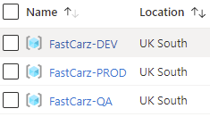
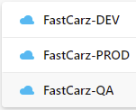
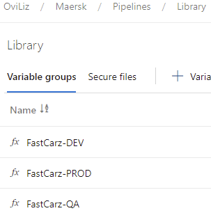
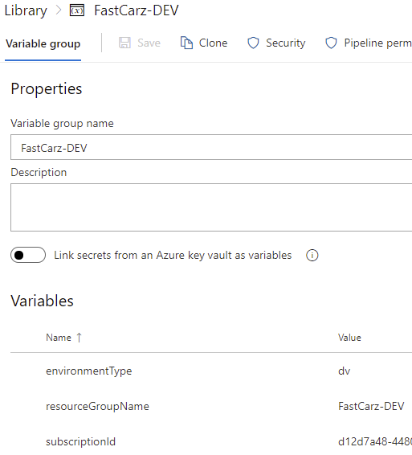
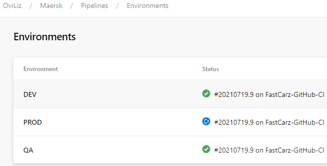
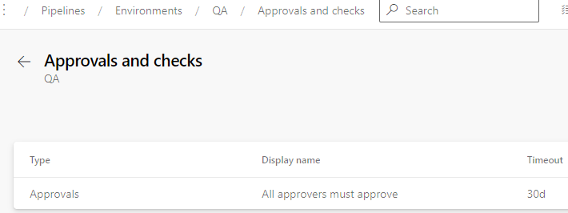
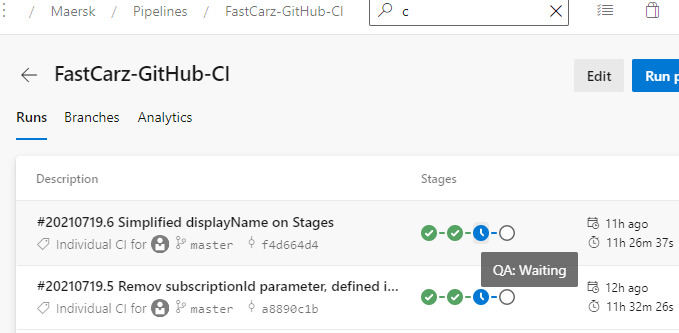
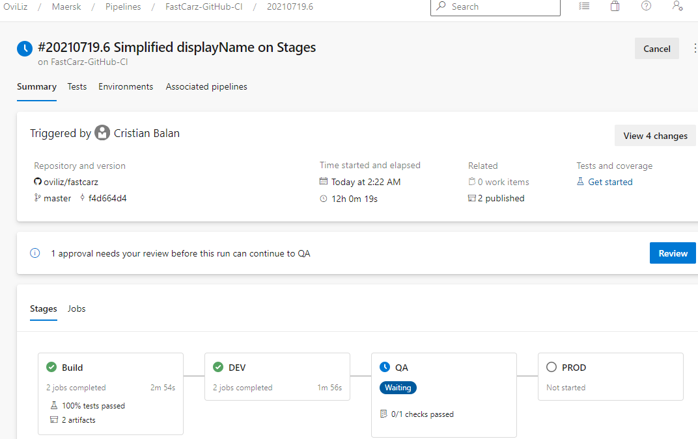

# Maersk Q1 FastCarz

## Scenario
A car rental company called FastCarz has a .net Web Application and Web API which are recently migrated from on-premise system to Azure cloud using Azure Web App Service and Web API Service. The on-premises system had 3 environments Dev, QA and Prod.
The code repository was maintained in TFS and moved to Azure GIT now. The TFS has daily builds which triggers every night which build the solution and copy the build package to drop folder.
Deployments were done to the respective environment manually. The customer is planning to setup Azure DevOps Pipeline service for below requirements:
1) The build should trigger as soon as anyone in the dev team checks in code to master branch.
2) There will be test projects which will create and maintained in the solution along the Web and API.
The trigger should build all the 3 projects - Web, API and test.
The build should not be successful if any test fails.
3) The deployment of code and artifacts should be automated to Dev environment.
4) Upon successful deployment to the Dev environment, deployment should be easily promoted to QA
and Prod through automated process.
5) The deployments to QA and Prod should be enabled with Approvals from approvers only.

Explain how each of the above the requirements will be met using Azure DevOps configuration.
Explain the steps with configuration details.

## Prerequisites
- Azure Subscription with Resource Groups for each environment (DEV, QA and PROD) with relevant IAM permissions; multiple separate Subscriptions is an alternative

- Azure DevOps (ADO) Project with at least a Team of individuals with QA and PROD approval responsibilities

- ADO Service Connections, one per Azure Resource Group (avoid granting general access to whole subscriptions!); to make life easier, name them after Resource Groups

- ADO Variable Groups, one per environment with respective Variables

- ADO Environments, with QA and PROD set to require approval from the defined Team

## IaC ARM
An Azure Resource Manager (ARM) template was created to define the Infrastructure as Code for hosting an Azure App Service Plan with two App Services (or Web Apps). This is located at [infra/azurearm.json](infra/azurearm.json). An Application Insights was also configured as it is usually the case with App Services.

## CI/CD
Continous Integration and Delivery is achieved through a single Pipeline using the [cicd/azure-pipelines.yml](cicd/azure-pipelines.yml) YAML file. This was linked to in the Azure DevOps and defines build steps as well as the different environmental stages.

Comments were added to the file to facilitate review and reading.

The Pipeline file links to [cicd/templates/releasetasks.yaml](cicd/templates/releasetasks.yaml) to reuse a list of release tasks across all our environmental stages. Also, a set of shared branch Variables was defined in [cicd/templates/variables/branchvariables.yaml](cicd/templates/variables/branchvariables.yaml).

## Summary
- All the Pipeline build steps are triggered as soon as code is commited to the master branch. In a more complete setup we could have multiple branch and policies and conditions created around these, including managing Pull Requests.
- The build steps include building and testing the API code and creating an artifact (an eventual additional "Web" app would follow similar principles so work wasn't replicated for the sake of this exercise). The ARM template code is also tested and validated against the DEV Resource Group before deployment.
- If none of the build steps fail, the deployment proceeds with processing the build artifacts to the DEV environment without any obstructions.
- Upon successful deployment to the DEV environment, the assigned team would have to approve proceeding with the QA deployment and successively with PROD.

